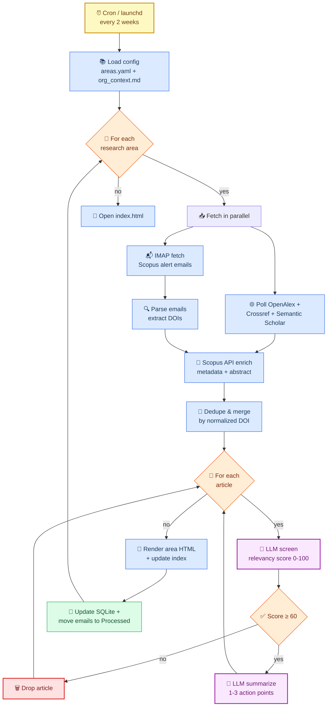

# Literature Digest Pipeline

Bi-weekly ingestion of peer-reviewed articles by research-area keywords,
LLM-screened for relevancy to an elite-sports organisation, published as
per-area HTML reports.



## Status

Phase 1 (skeleton) is complete. All modules have real signatures and
placeholder bodies; the pipeline runs end-to-end and produces empty reports.

| Phase | Status | What lands |
| ----- | :----: | ---------- |
| 1. Skeleton | ✅ | Project, config, models, store, sources (stubs), LLM (stubs), renderer, CLI, tests |
| 2. Free APIs | ⏳ | OpenAlex + Crossref + dedupe real implementations |
| 3. Scopus | ⏳ | IMAP email parser + Scopus Search API enrichment |
| 4. LLM | ⏳ | LiteLLM screening + action-point summarization |
| 5. Scheduling | ⏳ | launchd install instructions, end-to-end dry run |

## Quickstart

```bash
# 1. Install (uv recommended)
uv sync --extra dev

# 2. Configure secrets
cp .env.example .env
# edit .env: IMAP creds, SCOPUS_API_KEY, LIT_MODEL, LIT_API_KEY, CONTACT_EMAIL

# 3. Verify config loads
literature-digest list-areas

# 4. Run the pipeline (placeholders only at this stage)
literature-digest run --open

# 5. Run the smoke tests
pytest
```

## Project structure

```
literature-digest/
├── pyproject.toml
├── .env.example
├── config/
│   ├── areas.yaml                # per-area: name, slug, keywords, scopus_query, threshold
│   └── organisation_context.md   # screening criteria (single source of truth for the LLM prompt)
├── src/literature_digest/
│   ├── cli.py                    # `run`, `run --area`, `list-areas`, `test-imap`, `test-llm`
│   ├── config.py                 # typed Settings + areas.yaml / org_context loaders
│   ├── models.py                 # Article pydantic model (flows through every stage)
│   ├── store.py                  # SQLite: seen_dois, runs, area_state (idempotency)
│   ├── pipeline.py               # orchestrator: fetch -> dedupe -> screen -> summarize -> render
│   ├── screen.py                 # LiteLLM relevancy screener + LLMClient wrapper
│   ├── summarize.py              # LiteLLM action-point extractor
│   ├── report.py                 # Jinja2 -> index.html + per-area HTML
│   └── sources/
│       ├── scopus_email.py       # IMAP fetcher for Scopus alert emails
│       ├── scopus_api.py         # Elsevier Scopus Search API enrichment
│       ├── openalex.py           # OpenAlex keyword + DOI lookup
│       ├── crossref.py           # Crossref keyword + DOI lookup
│       └── dedupe.py             # DOI normalization + source-precedence merge
├── templates/{index,area}.html.j2
├── tests/                        # skeleton smoke tests + (later) vcrpy fixtures
├── scripts/launchd.plist.tmpl    # macOS 2-week schedule template
└── data/                         # gitignored: state.db, reports/, email cache
```

## Design notes

- **Provider-agnostic LLM** — swap OpenAI / Claude / Ollama by setting `LIT_MODEL` + the corresponding `*_API_KEY`. No code changes.
- **Idempotent state** — SQLite `seen_dois` + per-area `last_run` means re-running never duplicates and early/late runs self-correct.
- **Org context as a file** — `config/organisation_context.md` is the single place to refine what "relevant" means. Editing it requires no code change.
- **Polite API usage** — `mailto=` for OpenAlex/Crossref polite pools; backoff on Scopus API rate limits.
- **Source precedence on merge** — `scopus_api > openalex > crossref > scopus_email` (first non-null wins per field).
