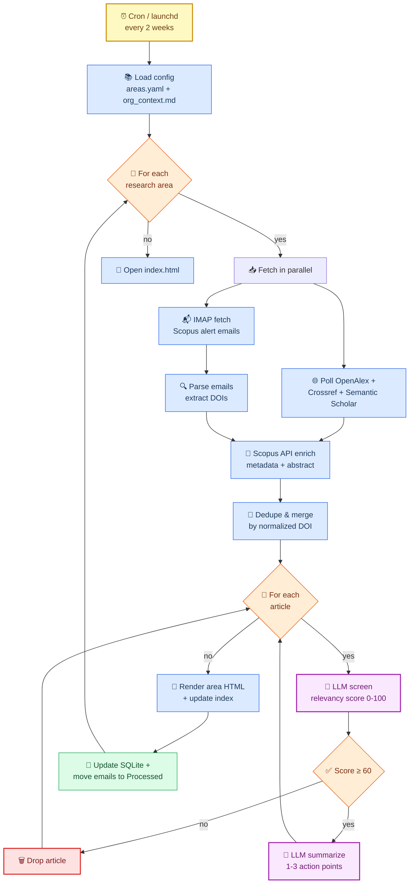

# Pipeline Diagram

Source of truth for the literature-digest pipeline flow. Phase 1 (skeleton)
is complete; the structure below stays stable as phases 2-5 fill in the
placeholder bodies.

## Stage mapping to modules

| Stage | Module | Phase |
| ----- | ------ | :---: |
| Load config | `config.py` | 1 ✅ |
| IMAP fetch | `sources/scopus_email.py` | 3 |
| Parse + extract DOIs | `sources/scopus_email.py` | 3 |
| Scopus API enrich | `sources/scopus_api.py` | 3 |
| Poll free APIs | `sources/openalex.py`, `sources/crossref.py` | 2 |
| Dedupe & merge | `sources/dedupe.py` | 2 |
| LLM screen | `screen.py` | 4 |
| LLM summarize | `summarize.py` | 4 |
| Render HTML | `report.py` | 1 ✅ |
| Update state | `store.py` | 1 ✅ |
| Orchestration | `pipeline.py` | 1 ✅ |
| Schedule | `scripts/launchd.plist.tmpl` | 5 |
