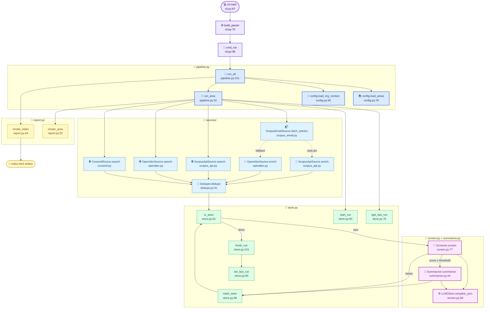

# Pipeline Internals — Scripts & Functions

A code-level view of the heavy lifting in `src/literature_digest/`. Each node is the
real function or method that does the work, with its source location. For the
conceptual flow (cron → ingest → screen → render), see
[Pipeline Diagram](pipeline.md).

## Where the heavy lifting lives

| Stage | Function | File:Line | What it does |
| ----- | -------- | --------- | ------------ |
| Entrypoint | `cli.main` | `cli.py:97` | Parse args, dispatch subcommand |
| Orchestration | `pipeline.run_all` | `pipeline.py:101` | Load config, build clients, loop areas, render index |
| Per-area | `pipeline.run_area` | `pipeline.py:32` | Fetch → enrich → dedupe → screen → summarize → persist |
| Email ingest | `ScopusEmailSource.fetch_articles` | `sources/scopus_email.py` | IMAP pull of Scopus alert emails |
| API ingest | `ScopusApiSource.search` / `.enrich` | `sources/scopus_api.py` | Scopus query + DOI enrichment |
| Free-API ingest | `OpenAlexSource.search` / `.enrich` | `sources/openalex.py` | OpenAlex query + DOI enrichment |
| Free-API ingest | `CrossrefSource.search` | `sources/crossref.py` | Crossref query |
| Merge | `Deduper.dedupe` | `sources/dedupe.py:31` | Normalize DOIs, merge by precedence |
| Screening | `Screener.screen` | `screen.py:77` | LLM relevancy score 0-100 + category |
| Summary | `Summarizer.summarize` | `summarize.py:44` | LLM action-point extraction (1-3) |
| LLM call | `LLMClient.complete_json` | `screen.py:58` | Single LiteLLM call, JSON-validated |
| State | `Store.*` | `store.py:61`-`109` | seen-DOI filter, run log, last-run cursor |
| Render | `ReportRenderer.render_area` / `.render_index` | `report.py:44`-`76` | Jinja2 → per-area + index HTML |

> Note: ingestion and LLM functions are currently placeholder bodies (Phases 2-4).
> The orchestrator shape and the render/state modules are stable from Phase 1.